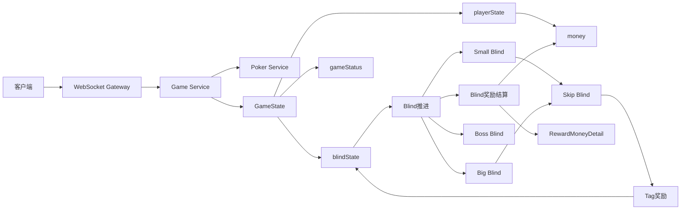

# 🎮 Balatro 实时游戏后端

> 从 0 到 1 实现一个 Balatro 风格的实时游戏后端，并持续记录工程化演进过程。

📖 配套博客持续更新中 -> 🔗 [CSDN](https://blog.csdn.net/weixin_43239068/category_13163951.html)

⭐ 当前开发阶段：奖励、商店与构筑成长系统

当前已完成：Blind / Boss Blind / Skip Blind / Tag 奖励机制 / Blind 奖励结算与金币状态设计

🚧 项目持续开发中

---

# 📋 项目概览

| 项目    | 内容                       |
| ----- | ------------------------ |
| 项目名称  | Balatro Realtime Backend |
| 开发语言  | TypeScript               |
| 后端框架  | NestJS                   |
| 通信方式  | WebSocket                |
| 测试框架  | Jest                     |
| CI/CD | GitHub Actions           |
| 当前阶段  | 奖励、商店与构筑成长系统             |
| 项目状态  | 持续开发中                    |
| 配套内容  | CSDN 系列博客                |

---

# 📖 项目简介

本项目用于从 0 到 1 实现一个 Balatro 风格的实时游戏后端，并逐步完成工程化演进。

项目不仅关注游戏玩法实现，更关注后端工程实践，包括：

* 状态机设计
* WebSocket 实时通信
* 游戏生命周期管理
* 奖励结算与经济系统
* Redis 缓存设计
* MySQL 持久化
* 服务恢复
* 单元测试
* CI 自动化
* 可扩展规则系统

因此，它不仅是一个游戏项目，也是一个长期演进的后端工程实践项目。

---

# 🏗 项目整体架构



---

# 🚀 当前开发进度

| 模块                | 状态 |
| ----------------- | -- |
| 牌型判断              | ✅  |
| 洗牌系统              | ✅  |
| 发牌系统              | ✅  |
| 出牌机制              | ✅  |
| 弃牌机制              | ✅  |
| 补牌机制              | ✅  |
| 得分系统              | ✅  |
| 单局结算              | ✅  |
| GameState 状态管理    | ✅  |
| Blind 系统          | ✅  |
| Boss Blind        | ✅  |
| Skip Blind        | ✅  |
| Tag 奖励系统          | ✅  |
| Blind 奖励结算        | ✅  |
| 金币状态设计            | ✅  |
| 经济规则配置            | ✅  |
| Jest 单元测试         | ✅  |
| GitHub Actions CI | ✅  |
| Joker 系统          | 🚧 |
| 商店系统              | 📌 |
| Redis 持久化         | 📌 |
| MySQL 持久化         | 📌 |
| Docker 部署         | 📌 |

---

# 🗺 Roadmap

## Phase 1：单局游戏流程

✅ 已完成

* 牌型判断
* 洗牌与发牌
* 出牌 / 弃牌 / 补牌
* 得分计算
* 单局结算

---

## Phase 2：Blind 关卡系统

✅ 已完成

* Blind 生命周期管理
* Boss Blind 特殊规则
* Skip Blind 机制
* Tag 奖励系统

---

## Phase 3：奖励、商店与构筑成长系统

🚧 开发中

* Blind 奖励结算
* 金币状态设计
* 利息结算规则
* 商店入口设计
* 商店购买 / 跳过 / 刷新
* Joker / Tag / Voucher 与经济系统联动

---

## Phase 4：持久化与缓存

📌 计划中

* Redis
* MySQL
* 状态恢复

---

## Phase 5：工程化部署

📌 计划中

* Docker
* 日志体系
* 配置管理

---

## Phase 6：效果系统与扩展玩法

📌 计划中

* Joker 系统
* Modifier 系统
* 特殊效果扩展

---

# 🛠 技术栈

### 已使用

* Node.js v22
* TypeScript 5.x
* NestJS
* WebSocket
* Jest
* GitHub Actions

### 规划中

* Redis
* MySQL
* Docker
* Docker Compose

---

# ⚡ 快速启动

## 安装依赖

```bash
npm install
```

## 启动项目

```bash
# development
npm run start

# watch mode
npm run start:dev

# production
npm run start:prod
```

---

## WebSocket 地址

```text
ws://localhost:8088
```

### initGame

```json
{
   "event": "initGame",
   "data": {}
}
```

### startGame

```json
{
  "event": "startGame",
  "data": {}
}
```

---

## selectCards

```json
{
  "event": "selectCards",
  "data": {
    "selectedCards": ["9C", "8D"],
    "action": "play"
  }
}
```

---

## skipBlind

```json
{
  "event": "skipBlind",
  "data": {
    "blindType": "small",
    "round": 1
  }
}
```

---

## 运行测试

```bash
npm test
```

---

# 📚 系列文章

本项目与博客同步演进。

每篇文章对应一个具体开发阶段与代码版本。

## 主线系列

1. 项目规划与牌型判断实现
2. NestJS框架搭建与项目结构设计
3. 洗牌、发牌与服务端牌堆状态管理
4. 玩家手牌操作与状态流转设计
5. 得分计算与单局结算流程实现
6. Blind关卡状态设计与回合推进实现
7. Boss Blind与特殊规则实现
8. 跳过Blind与Tag奖励机制设计
9. Blind奖励结算与金币状态设计（进行中）

## 进阶系列

1. 自定义NestJS WebSocket Adapter实现消息拦截
2. 基于GitHub Actions的CI自动化验证实现
3. 为什么机制设计比写代码更难

---

# 🎯 项目目标

通过完整实现一个实时卡牌游戏后端，逐步实践：

* 状态驱动设计
* 实时通信架构
* 游戏生命周期管理
* 奖励结算与经济系统
* 缓存与持久化
* 服务恢复能力
* 自动化测试
* 工程化部署

并将整个过程持续记录为系列技术博客。

项目持续更新中……
