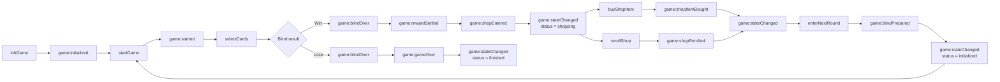

## Project Status

🚧 Currently in active development

Current focus:

* Shop item pool and runtime item generation
* Shop phase lifecycle
* Shop item purchase and reroll flow
* Reward-to-shop game loop
* Stateful game lifecycle evolution
* Realtime game state synchronization

Completed recently:

* Blind / stage progression system
* Boss Blind mechanics
* Skip Blind and Tag reward system
* Blind reward settlement
* Player money state
* Basic economy rule configuration
* Shop entry after Blind win
* Shop item pool configuration
* Rarity-based Joker item generation
* Runtime shop item instance generation
* Shop item purchase flow
* Shop reroll flow
* Enter next Blind preparation from shop
* WebSocket API contract documentation

---

# balatro-realtime-backend

## Introduction

A realtime backend system for a Balatro-like card game, built with Node.js, TypeScript, NestJS and WebSocket.

This project is not only a game logic practice, but also a long-term backend engineering project.

This project is inspired by Balatro, but focuses primarily on backend architecture, realtime game state management, and progressive system design rather than recreating the original game entirely.

The goal is to gradually implement core backend capabilities through a complete card game server, including:

* state management
* reward settlement
* economy system design
* cache layering
* persistence
* recovery
* testing
* extensibility

本项目用于从 0 到 1 实现一个 Balatro 风格的游戏后端，并逐步进行工程化改造。

项目不仅仅是算法练习，也不是简单的游戏复刻，而是希望通过完整实现一个卡牌游戏后端，逐步实践后端工程中常见的核心能力，例如：

* 状态机设计
* WebSocket 实时通信
* Blind 生命周期管理
* 奖励结算与经济系统
* Redis 缓存分层
* MySQL 持久化
* 游戏状态恢复
* Docker 部署
* 单元测试
* 可扩展的规则系统

---

## Tech Stack

| Area                   | Tech                            |
| ---------------------- | ------------------------------- |
| Runtime                | Node.js v22                     |
| Language               | TypeScript 5.x                  |
| Framework              | NestJS                          |
| Realtime Communication | Native WebSocket                |
| Testing                | Jest                            |
| CI                     | GitHub Actions                  |
| Cache                  | Redis planned                   |
| Database               | MySQL planned                   |
| Deployment             | Docker / Docker Compose planned |

---

## Backend Architecture

### Current modules

* WebSocket Gateway (entry point)
* Game Service (game lifecycle orchestration)
* Shop Service (shop item pool and runtime shop state generation)
* Poker Service (card rules and scoring logic)
* State-driven game lifecycle management
* In-memory per-player runtime state
* Player state management
* Blind / Ante / Round state management
* Blind score and reward configuration
* Boss Blind rule handling
* Skip Blind decision flow
* Tag preview assignment and runtime tag handling
* Reward settlement and money state update
* Basic economy rule configuration
* Shop phase state management
* Rarity-based Joker item generation
* Runtime shop item instance generation
* Shop item purchase and reroll flow
* Player-owned Joker placeholder state
* WebSocket domain events and final state snapshot response

### Current lifecycle



### State responsibility

| State Part    | Responsibility                                                  |
| ------------- | --------------------------------------------------------------- |
| `playerState` | Player hand, deck, play / discard count, money and owned Jokers |
| `blindState`  | Current Blind / Ante / score target / current Blind score       |
| `shopState`   | Current shop items and reroll cost                              |
| `gameStatus`  | Current lifecycle status                                        |

### Current state structure

```text
- GameState
  - playerId

  - playerState
    - deck
    - hand
    - playsLeft
    - discardsLeft
    - handSize
    - currentActionScore
    - money
    - jokers

  - blindState
    - round
    - ante
    - blindType
    - targetScore
    - currentBlindScore
    - currentAnteConfig

  - shopState?
    - items
      - instanceId
      - configId
      - name
      - type
      - rarity
      - price
      - description
      - purchased
    - rerollCost

  - gameStatus
    - initialized
    - playing
    - shopping
    - finished
```

### Current WebSocket response model

```text
- actionResult
  - only used for play / discard result

- events
  - game:blindOver
  - game:rewardSettled
  - game:shopEntered
  - game:shopItemBought
  - game:shopRerolled
  - game:blindPrepared
  - game:gameOver
  - game:error

- state
  - latest GameStateResponse snapshot
```

The backend separates domain events from the final state snapshot.

For example, after winning a Blind:

```text
game:blindOver      -> completed Blind
game:rewardSettled  -> reward result
game:shopEntered    -> generated shop state
game:stateChanged   -> latest final state, usually shopping
```

### Future improvements

* Real Joker effect system
* Joker scoring pipeline
* Modifier / effect execution system
* Voucher / Tag / Joker economy interaction
* More representative Boss Blind effects
* More representative Tag effects
* Tarot / Planet / Spectral card prototypes
* Redis for runtime state persistence
* MySQL for long-term storage
* Reconnect and state recovery
* Distributed session handling
* Frontend visualization

The system is evolving from a single-game lifecycle into a staged game engine with Blind-based progression, reward settlement, shop phase, and build-growth loops.

---

## Project Goals

* Implement a realtime game backend
* Practice backend architecture design
* Build a state-driven game engine
* Support reward settlement and economy growth
* Support cache + persistence layering
* Support recovery after restart
* Keep the project extensible
* Record the whole process as a blog series

---

## Roadmap

| Phase   | Topic                                | Status      |
| ------- | ------------------------------------ | ----------- |
| Phase 1 | Single game flow                     | Done        |
| Phase 2 | Blind / stage system                 | Done        |
| Phase 3 | Reward, shop and build-growth system | In progress |
| Phase 4 | Joker / modifier / effect system     | Planned     |
| Phase 5 | Persistence and cache                | Planned     |
| Phase 6 | Engineering and deployment           | Planned     |
| Phase 7 | Special cards                        | Planned     |
| Phase 8 | AI / Go / extension                  | Planned     |

---

## Current Features

| Area             | Features                                                                    |
| ---------------- | --------------------------------------------------------------------------- |
| WebSocket        | Native WebSocket gateway, command-based message handling, server event push |
| Poker Logic      | Hand evaluation, valid card detection, score calculation                    |
| Player State     | Server-side hand, deck, play / discard count, money, owned Jokers           |
| Blind System     | Ante / round / blindType state, target score, current Blind score           |
| Boss Blind       | Representative Boss Blind rule handling                                     |
| Skip Blind / Tag | Skip flow, Tag reward preview, basic runtime Tag effects                    |
| Economy          | Blind reward, remaining hand bonus, interest calculation, money update      |
| Shop             | Shop | Shop entry, rarity-based Joker item generation, runtime item instances, buy item, reroll shop, enter next Blind        |
| Events           | Domain events + final `game:stateChanged` snapshot                          |
| Testing          | Jest unit tests and integration-like tests                                  |
| CI               | GitHub Actions automation                                                   |
| Documentation    | WebSocket API contract document                                             |

---

## Current Progress

### Phase 1 - Single game flow

✔ Card type judgment implementation   
✔ Unit test for hand evaluation  
✔ Initialize NestJS structure   
✔ Migrate hand evaluator to module   
✔ Add WebSocket gateway   
✔ Implement deck generation (52 cards)   
✔ Implement shuffle algorithm (Fisher-Yates)   
✔ Implement card dealing logic  
✔ Introduce server-side deck state management  
✔ Implement play / discard / draw flow   
✔ Add scoring calculation    
✔ Add round settlement logic    
✔ Add game over state management      
✔ Refactor and extend unit tests      

### Phase 2 - Blind / stage system

✔ Refactor GameState into playerState and blindState   
✔ Add Blind score configuration  
✔ Add round / ante / blindType state  
✔ Add currentBlindScore and targetScore tracking  
✔ Implement Blind settlement flow  
✔ Advance to next Blind after clearing current Blind   
✔ Reset game state after failure   
✔ Update unit tests for Blind progression   
✔ Add Boss Blind special rules  
✔ Add Skip Blind action handling   
✔ Add Tag reward preview to Blind state  
✔ Implement basic Tag runtime handling   
✔ Support representative Tag effects (Boss Tag, Juggle Tag)

### Phase 3 - Reward, shop and build-growth system

🚧 In progress

| Module                   |    Status | Description                                |
| ------------------------ | --------: | ------------------------------------------ |
| Money State              |    ✔ Done | Add player money state                     |
| Blind Reward Config      |    ✔ Done | Add base reward money configuration        |
| Economy Rules            |    ✔ Done | Add reward and interest rule configuration |
| Reward Detail            |    ✔ Done | Add reward detail response structure       |
| Blind Reward Settlement  |    ✔ Done | Settle reward after Blind win              |
| Remaining Play Bonus     |    ✔ Done | Add bonus money from remaining plays       |
| Interest Reward          |    ✔ Done | Add basic interest calculation             |
| Money Update             |    ✔ Done | Update player money after Blind win        |
| Shop Entry               |    ✔ Done | Enter shop after Blind win                 |
| Shop State               |    ✔ Done | Add basic shop state structure             |
| Basic Joker Items | ✔ Done | Add initial Joker item configs for shop flow |
| Joker Item Config Pool        | ✔ Done | Expand Joker item configs as shop item pool |
| Shop Item Instance Generation | ✔ Done | Convert static item configs into runtime shop items |
| Rarity-based Joker Generation | ✔ Done | Generate Joker shop items by rarity weight |
| Buy Shop Item            |    ✔ Done | Buy shop item and mark item as purchased   |
| Player-owned Joker State |    ✔ Done | Store bought Joker in player state         |
| Reroll Shop              |    ✔ Done | Spend money to refresh shop items          |
| Next Blind Preparation   |    ✔ Done | Leave shop and emit `game:blindPrepared`   |
| WebSocket API Contract   |    ✔ Done | Add detailed WebSocket API document        |
| Real Joker Effects       | ⏳ Planned | Add representative Joker scoring effects   |
| Modifier Pipeline        | ⏳ Planned | Add unified effect execution pipeline      |

Planned next:

* Refine player-owned Joker response and runtime Joker state boundaries
* Add representative Joker effects
* Design Joker effect trigger timing
* Introduce basic modifier / effect execution pipeline
* Expand Tag / Joker / economy interaction
* Prepare persistence boundary for runtime game state

---

## How to Run

### 1. WebSocket API

The backend uses native WebSocket for real-time game communication.

For detailed client commands, server events, and payload structures, see:

* [Game WebSocket Contract / 游戏 WebSocket 通信协议](./docs/websocket-api.md)

### 2. Run the server

```bash
npm install

# development
npm run start

# watch mode
npm run start:dev

# production mode
npm run start:prod
```

### 3. Test with Postman

Connect to:

```text
ws://localhost:8088
```

#### initGame

```json
{
  "event": "initGame",
  "data": {}
}
```

#### startGame

```json
{
  "event": "startGame",
  "data": {}
}
```

#### selectCards

```json
{
  "event": "selectCards",
  "data": {
    "selectedCards": ["9C", "8D"],
    "action": "play"
  }
}
```

#### skipBlind

```json
{
  "event": "skipBlind",
  "data": {
    "blindType": "small",
    "round": 1
  }
}
```

#### buyShopItem

The `instanceId` should be taken from `shopState.items`, for example `shop_item_player-1_0`.

```json
{
  "event": "buyShopItem",
  "data": {
    "instanceId": "shop_item_player-1_0"
  }
}
```

#### rerollShop

```json
{
  "event": "rerollShop",
  "data": {}
}
```

#### enterNextRound

```json
{
  "event": "enterNextRound",
  "data": {}
}
```

### 4. Run tests

```bash
npm test
```

---

## Blog Series

This repository evolves alongside a long-term blog series documenting the full backend implementation process.

Architecture, game state management and engineering structure are continuously refactored and expanded as the project grows.

Each article corresponds to a specific implementation stage and commit history.

---

### Released Articles

🔗 Full Blog Series -> [CSDN](https://blog.csdn.net/weixin_43239068/category_13163951.html)

#### Core Series

1. Project Planning and Hand Evaluation.  
   从0到1实现 Balatro 游戏后端（1）：项目规划与牌型判断实现

2. NestJS Setup and Project Structure Design    
   从0到1实现 Balatro 游戏后端（2）：NestJS框架搭建与项目结构设计

3. Shuffling, Dealing and Server-side Deck State Management    
   从0到1实现Balatro游戏后端（3）：洗牌、发牌与服务端牌堆状态管理

4. Player Hand Operations and State Flow Design    
   从0到1实现Balatro游戏后端（4）：玩家手牌操作（出牌 / 弃牌 / 补牌）与状态流转设计

5. Scoring Calculation and Single-game Settlement Flow      
   从0到1实现Balatro游戏后端（5）：得分计算与单局结算流程实现

6. Blind Stage State Design and Lifecycle Progression    
   从0到1实现Balatro游戏后端（6）：Blind关卡状态设计与回合推进实现

7. Boss Blind Design and Special Rule Handling  
   从0到1实现Balatro游戏后端（7）：Boss Blind与特殊规则实现

8. Skip Blind and Tag Reward Mechanism Design   
   从0到1实现Balatro游戏后端（8）：跳过Blind与Tag奖励机制设计

9. Blind Reward Settlement and Money State Design  
   从0到1实现Balatro游戏后端（9）：Blind奖励结算与金币状态设计
10. Shop Phase and Item Purchase Lifecycle Design  
    从0到1实现Balatro游戏后端（10）：商店阶段与商品购买闭环实现

#### Advanced Topics

1. Custom NestJS WebSocket Adapter for Message Interception   
   Balatro后端进阶（1）：自定义NestJS WebSocket Adapter实现消息拦截

2. CI Automation with GitHub Actions   
   Balatro后端进阶（2）：基于GitHub Actions的CI自动化验证实现

3. Why Mechanism Design Makes Code Harder   
   Balatro后端进阶（3）：为什么机制设计比写代码更难

---

### Upcoming Articles

11. Shop Item Pool and Runtime Item Generation Design  
    从0到1实现Balatro游戏后端（11）：商店商品池与运行时商品生成机制设计

(Updating...)
