# Game WebSocket API / 游戏 WebSocket 通信协议

This document describes the WebSocket communication contract between the client and the Balatro backend.

本文档用于记录客户端与 Balatro 后端之间的 WebSocket 通信协议，包括客户端请求、服务端事件推送、状态快照、事件顺序以及常用数据结构。

The project currently uses native WebSocket instead of Socket.IO.

当前项目使用的是原生 WebSocket，而不是 Socket.IO。因此客户端和服务端都通过统一 JSON 格式进行通信。

---

## 1. Overview / 概览

### 1.1 Communication Model / 通信模型

The client sends commands to the server.

客户端主动发送请求命令给服务端。

The server responds by sending one or more events back to the client.

服务端通过一条或多条事件消息返回处理结果。

For example, when the player plays cards and wins the current Blind, the server may send:

```text
game:actionResult
game:blindOver
game:rewardSettled
game:shopEntered
game:stateChanged
```

### 1.2 Server Is the Source of Truth / 服务端是最终状态来源

The server owns the authoritative game state.

服务端维护最终可信状态。

The client should not trust local cached data such as:

客户端不应把本地缓存当成最终事实，例如：

* hand cards / 当前手牌
* remaining deck count / 剩余牌堆数量
* play / discard counts / 剩余出牌与弃牌次数
* money / 金币
* current Blind state / 当前 Blind 状态
* shop items / 商店商品
* owned Jokers / 已拥有 Joker

The client should use `game:stateChanged` to refresh the latest UI state.

客户端应使用 `game:stateChanged` 同步最新页面状态。

---

## 2. Message Format / 消息格式

### 2.1 Client Command Format / 客户端请求格式

The client sends commands in the following format:

客户端发送给服务端的请求统一使用以下格式：

```json
{
  "event": "selectCards",
  "data": {}
}
```

| Field   | Type     | Required | Description                    |
| ------- | -------- | -------: | ------------------------------ |
| `event` | `string` |      Yes | Client command name / 客户端请求命令名 |
| `data`  | `object` |      Yes | Request payload / 请求参数         |

### 2.2 Server Event Format / 服务端事件格式

The server sends events in the following format:

服务端推送给客户端的消息统一使用以下格式：

```json
{
  "event": "game:stateChanged",
  "data": {}
}
```

| Field   | Type     | Required | Description                |
| ------- | -------- | -------: | -------------------------- |
| `event` | `string` |      Yes | Server event name / 服务端事件名 |
| `data`  | `object` |      Yes | Event payload / 事件数据       |

### 2.3 Error Event Format / 错误事件格式

When a command fails, the server may emit `game:error`.

当请求处理失败时，服务端可能推送 `game:error`。

```json
{
  "event": "game:error",
  "data": {
    "code": 301,
    "message": "Player state not found"
  }
}
```

```ts
{
  code: number;
  message: string;
}
```

---

## 3. Events vs State Snapshot / 过程事件与状态快照

Domain events describe what happened during a command.

领域事件描述“一次请求过程中发生了什么”。

`game:stateChanged` describes the latest state after all mutations.

`game:stateChanged` 描述“所有状态修改完成后的最终快照”。

```mermaid
flowchart LR
    A["Client Command<br/>客户端请求"]

    subgraph EVENTS["Domain Events / 过程事件"]
        B["game:actionResult"]
        C["game:blindOver"]
        D["game:rewardSettled"]
        E["game:shopEntered"]
    end

    F["game:stateChanged<br/>Latest State Snapshot<br/>最终状态快照"]

    A --> B --> C --> D --> E --> F

    classDef command fill:aliceblue,stroke:cornflowerblue,stroke-width:2px,color:black
    classDef event fill:cornsilk,stroke:orange,color:black
    classDef snapshot fill:honeydew,stroke:mediumseagreen,stroke-width:2px,color:black

    class A command
    class B,C,D,E event
    class F snapshot
````

Important:

重点说明：

`game:blindOver.blindState` describes the completed Blind.

`game:stateChanged.blindState` describes the latest current Blind after progression.

For example:

```text
game:blindOver.blindState.blindType = "small"
game:stateChanged.blindState.blindType = "big"
```

This means the Small Blind has ended, and the next Big Blind has already been prepared internally.

这表示 Small Blind 已经结束，而服务端内部已经推进到了下一个 Big Blind。


---

## 4. Command Summary / 客户端请求总览

| Command          | Allowed Status | Main Success Events                                            | Description                                         |
| ---------------- | -------------- | -------------------------------------------------------------- | --------------------------------------------------- |
| `initGame`       | Any            | `game:initialized`                                             | Create or reset game state / 创建或重置游戏状态              |
| `startGame`      | `initialized`  | `game:started`                                                 | Deal cards and enter playing / 发牌并进入 playing        |
| `selectCards`    | `playing`      | `game:actionResult`, `game:stateChanged`                       | Play or discard cards / 出牌或弃牌                       |
| `skipBlind`      | `initialized`  | `game:blindSkipped`, `game:blindPrepared`, `game:stateChanged` | Skip Small or Big Blind / 跳过 Small 或 Big Blind      |
| `buyShopItem`    | `shopping`     | `game:shopItemBought`, `game:stateChanged`                     | Buy a shop item / 购买商店商品                            |
| `rerollShop`     | `shopping`     | `game:shopRerolled`, `game:stateChanged`                       | Reroll shop items / 刷新商店                            |
| `enterNextRound` | `shopping`     | `game:blindPrepared`, `game:stateChanged`                      | Leave shop and prepare next Blind / 离开商店并准备下一 Blind |

---

## 5. Client Commands / 客户端请求详情

### 5.1 `initGame` / 初始化游戏

Create or reset the game state for the current WebSocket client.

为当前 WebSocket 连接对应的玩家创建或重置游戏状态。

This command does not deal cards.

该请求不会发牌。真正开始当前 Blind 需要继续调用 `startGame`。

#### Request

```json
{
  "event": "initGame",
  "data": {}
}
```

#### Request Params

No request params.

无请求参数。

#### Success Event Sequence

```text
game:initialized
```

#### `game:initialized` Data

Current implementation returns the internal `GameState`.

当前实现中，`initGame` 返回内部 `GameState`。

Note:

说明：

This may be normalized to `GameStateResponse` in the future.

后续可能会统一成 `GameStateResponse`，避免向客户端暴露内部字段。

```ts
{
  playerId: string;

  playerState: {
    deck: Card[];
    hand: string[];
    playsLeft: number;
    discardsLeft: number;
    handSize: number;
    currentActionScore: number;
    money: number;
    jokers: PlayerJoker[];
  };

  blindState: {
    round: number;
    ante: number;
    blindType: "small" | "big" | "boss";
    targetScore: number;
    currentBlindScore: number;
    currentAnteConfig: AnteConfig;
  };

  shopState?: ShopState;

  gameStatus: "initialized" | "playing" | "shopping" | "finished";
}
```

#### Example Server Message

```json
{
  "event": "game:initialized",
  "data": {
    "playerId": "::1:64727",
    "playerState": {
      "deck": [],
      "hand": [],
      "playsLeft": 5,
      "discardsLeft": 3,
      "handSize": 8,
      "currentActionScore": 0,
      "money": 0,
      "jokers": []
    },
    "blindState": {
      "round": 1,
      "ante": 1,
      "blindType": "small",
      "targetScore": 150,
      "currentBlindScore": 0,
      "currentAnteConfig": {
        "ante": 1,
        "small": {
          "score": 150,
          "tagCode": 201,
          "baseRewardMoney": 3
        },
        "big": {
          "score": 250,
          "tagCode": 202,
          "baseRewardMoney": 4
        },
        "boss": {
          "score": 350,
          "code": 111,
          "name": "The Two Pair",
          "baseRewardMoney": 5
        }
      }
    },
    "gameStatus": "initialized"
  }
}
```

#### Possible Errors

|                  Code | Event        | Description                       |
| --------------------: | ------------ | --------------------------------- |
| `CLIENT_ID_NOT_FOUND` | `game:error` | Client id is missing / 客户端 ID 不存在 |

---

### 5.2 `startGame` / 开始当前 Blind

Start the current prepared Blind and deal cards to the player.

开始当前已准备好的 Blind，并给玩家发放初始手牌。

This command should only be called when the game status is `initialized`.

该请求只应该在 `initialized` 状态下调用。

#### Request

```json
{
  "event": "startGame",
  "data": {}
}
```

#### Request Params

No request params.

无请求参数。

#### Success Event Sequence

```text
game:started
```

#### `game:started` Data

```ts
{
  code: number;
  message: string;

  playerState?: {
    hand: string[];
    remainingDeckCount: number;
    playsLeft: number;
    discardsLeft: number;
    money: number;
  };

  blindState?: {
    round: number;
    ante: number;
    blindType: "small" | "big" | "boss";
    targetScore: number;
    currentAnteConfig: AnteConfig;
  };
}
```

#### Example Server Message

```json
{
  "event": "game:started",
  "data": {
    "code": 200,
    "message": "Success",
    "playerState": {
      "hand": ["QS", "QC", "JH", "7S", "6C", "5H", "4S", "2H"],
      "remainingDeckCount": 44,
      "playsLeft": 5,
      "discardsLeft": 3,
      "money": 0
    },
    "blindState": {
      "round": 1,
      "ante": 1,
      "blindType": "small",
      "targetScore": 150,
      "currentAnteConfig": {
        "ante": 1,
        "small": {
          "score": 150,
          "tagCode": 201,
          "baseRewardMoney": 3
        },
        "big": {
          "score": 250,
          "tagCode": 202,
          "baseRewardMoney": 4
        },
        "boss": {
          "score": 350,
          "code": 111,
          "name": "The Two Pair",
          "baseRewardMoney": 5
        }
      }
    }
  }
}
```

#### Possible Errors

`startGame` is sent directly as `game:started`, even when the returned result contains an error code.

当前 `startGame` 的返回会直接通过 `game:started` 发送，即使返回内容中包含错误码。

|                   Code | Event          | Description                                       |
| ---------------------: | -------------- | ------------------------------------------------- |
|  `CLIENT_ID_NOT_FOUND` | `game:error`   | Client id is missing / 客户端 ID 不存在                 |
|       `GAME_NOT_FOUND` | `game:started` | Game state does not exist / 游戏状态不存在               |
| `GAME_ALREADY_STARTED` | `game:started` | Current game cannot be started again / 当前游戏不能重复开始 |

---

### 5.3 `selectCards` / 出牌或弃牌

Play or discard selected cards.

玩家选择手牌后执行出牌或弃牌操作。服务端会校验所选牌是否存在于玩家手牌中，并根据操作类型更新玩家状态。

#### Request

```json
{
  "event": "selectCards",
  "data": {
    "selectedCards": ["AH", "KH", "QH"],
    "action": "play"
  }
}
```

#### Request Params

| Field           | Type                  | Required | Description              |
| --------------- | --------------------- | -------: | ------------------------ |
| `selectedCards` | `string[]`            |      Yes | Selected cards / 玩家选择的牌  |
| `action`        | `"play" \| "discard"` |      Yes | Card action type / 出牌或弃牌 |

#### Allowed GameStatus

```text
playing
```

#### Success Event Sequence

Normal play or discard:

普通出牌或弃牌：

```text
game:actionResult
game:stateChanged
```

Blind win:

打赢 Blind：

```text
game:actionResult
game:blindOver
game:rewardSettled
game:shopEntered
game:stateChanged
```

Blind lose:

打输 Blind：

```text
game:actionResult
game:blindOver
game:gameOver
game:stateChanged
```

Run completed:

通关最后一个 Boss Blind：

```text
game:actionResult
game:blindOver
game:gameOver
game:stateChanged
```

#### `game:actionResult` Data

```ts
{
  action: "play" | "discard";

  scoreDetail?: {
    selectedCards: string[];
    cardType: number;
    validCards: string[];
    baseScore: number;
    multiplier: number;
  };
}
```

#### Example Server Message

Discard:

```json
{
  "event": "game:actionResult",
  "data": {
    "action": "discard",
    "scoreDetail": {
      "selectedCards": ["JH", "7S", "5H", "4S", "2H"],
      "cardType": 0,
      "validCards": [],
      "baseScore": 0,
      "multiplier": 0
    }
  }
}
```

Play:

```json
{
  "event": "game:actionResult",
  "data": {
    "action": "play",
    "scoreDetail": {
      "selectedCards": ["6S", "5C", "5D"],
      "cardType": 2,
      "validCards": ["5C", "5D"],
      "baseScore": 20,
      "multiplier": 2
    }
  }
}
```

#### Possible Errors

|                       Code | Event        | Description                                  |
| -------------------------: | ------------ | -------------------------------------------- |
|      `CLIENT_ID_NOT_FOUND` | `game:error` | Client id is missing / 客户端 ID 不存在            |
|                `NOT_FOUND` | `game:error` | Player state not found / 玩家状态不存在             |
|         `GAME_NOT_STARTED` | `game:error` | Game is not in playing state / 游戏未开始或状态不允许操作 |
|     `EMPTY_SELECTED_CARDS` | `game:error` | No selected cards / 未选择任何牌                   |
|     `CARDS_LIMIT_EXCEEDED` | `game:error` | Selected cards exceed limit / 选择牌数超过限制       |
|      `INVALID_CARD_FORMAT` | `game:error` | Invalid card format / 牌格式错误                  |
|         `CARD_NOT_IN_HAND` | `game:error` | Selected card is not in hand / 所选牌不在当前手牌中    |
| `DUPLICATE_SELECTED_CARDS` | `game:error` | Duplicate selected cards / 重复选择同一张牌          |
|           `INVALID_ACTION` | `game:error` | Action is not supported / 不支持的操作类型           |
|            `NO_PLAYS_LEFT` | `game:error` | No plays left / 没有剩余出牌次数                     |
|         `NO_DISCARDS_LEFT` | `game:error` | No discards left / 没有剩余弃牌次数                  |

---

### 5.4 `skipBlind` / 跳过 Blind

Skip the current Small Blind or Big Blind.

跳过当前 Small Blind 或 Big Blind。

Boss Blind cannot be skipped.

Boss Blind 不允许跳过。

This command is usually called before starting the current Blind.

该请求通常在当前 Blind 还未开始时调用，也就是 `initialized` 状态下调用。

#### Request

```json
{
  "event": "skipBlind",
  "data": {
    "blindType": "small",
    "round": 1
  }
}
```

#### Request Params

| Field       | Type               | Required | Description                                     |
| ----------- | ------------------ | -------: | ----------------------------------------------- |
| `blindType` | `"small" \| "big"` |      Yes | Blind type to skip / 要跳过的 Blind 类型              |
| `round`     | `number`           |      Yes | Current round from client / 客户端当前 round，用于服务端校验 |

#### Allowed GameStatus

```text
initialized
```

#### Success Event Sequence

```text
game:blindSkipped
game:blindPrepared
game:stateChanged
```

#### `game:blindSkipped` Data

```ts
{
  blindType: "small" | "big";
  tagCode: number;
}
```

#### `game:blindPrepared` Data

```ts
{
  blindState: BlindStateResponse;
  anteConfig: AnteConfig;
}
```

#### Example Server Messages

```json
{
  "event": "game:blindSkipped",
  "data": {
    "blindType": "small",
    "tagCode": 201
  }
}
```

```json
{
  "event": "game:blindPrepared",
  "data": {
    "blindState": {
      "round": 2,
      "ante": 1,
      "blindType": "big",
      "targetScore": 250,
      "currentBlindScore": 0
    },
    "anteConfig": {
      "ante": 1,
      "small": {
        "score": 150,
        "tagCode": 201,
        "baseRewardMoney": 3
      },
      "big": {
        "score": 250,
        "tagCode": 202,
        "baseRewardMoney": 4
      },
      "boss": {
        "score": 350,
        "code": 103,
        "name": "The Heart",
        "baseRewardMoney": 5
      }
    }
  }
}
```

#### Possible Errors

|                  Code | Event        | Description                                                                    |
| --------------------: | ------------ | ------------------------------------------------------------------------------ |
| `CLIENT_ID_NOT_FOUND` | `game:error` | Client id is missing / 客户端 ID 不存在                                              |
|           `NOT_FOUND` | `game:error` | Player state not found / 玩家状态不存在                                               |
|      `INVALID_ACTION` | `game:error` | Blind type is not skippable / 当前 Blind 不允许跳过                                   |
| `INVALID_BLIND_STATE` | `game:error` | Client blindType or round does not match server state / 客户端提交的 Blind 状态与服务端不一致 |

---

### 5.5 `buyShopItem` / 购买商店商品

Buy an item from the current shop.

购买当前商店中的某个商品。

Current stage only supports virtual Joker items.

当前阶段商店商品主要是虚拟 Joker，用于跑通商店购买流程，不处理 Joker 的具体得分效果。

#### Request

```json
{
  "event": "buyShopItem",
  "data": {
    "instanceId": "shop_item_1"
  }
}
```

#### Request Params

| Field        | Type     | Required | Description                                 |
| ------------ | -------- | -------: | ------------------------------------------- |
| `instanceId` | `string` |      Yes | Runtime shop item instance id / 当前商店商品实例 ID |

#### Allowed GameStatus

```text
shopping
```

#### Success Event Sequence

```text
game:shopItemBought
game:stateChanged
```

#### `game:shopItemBought` Data

```ts
{
  item: ShopItemResponse;
  moneyAfterPurchase: number;
}
```

#### Example Server Message

```json
{
    "event": "game:shopItemBought",
    "data": {
        "item": [
            {
                "instanceId": "shop_item_::1:53205_0",
                "configId": 1004,
                "name": "Wrathful Joker",
                "type": "joker",
                "rarity": "common",
                "price": 5,
                "description": "Played Spade cards give +3 Mult when scored. Effect will be implemented later.",
                "effectType": "add_to_joker_slots",
                "purchased": true
            },
            {
                "instanceId": "shop_item_::1:53205_1",
                "configId": 1008,
                "name": "Joker Stencil",
                "type": "joker",
                "rarity": "uncommon",
                "price": 8,
                "description": "X Mult based on empty Joker slots. Effect will be implemented later.",
                "effectType": "add_to_joker_slots",
                "purchased": false
            }
        ],
        "moneyAfterPurchase": 2
    }
}
```

#### Possible Errors

|                           Code | Event        | Description                               |
| -----------------------------: | ------------ | ----------------------------------------- |
|          `CLIENT_ID_NOT_FOUND` | `game:error` | Client id is missing / 客户端 ID 不存在         |
|                    `NOT_FOUND` | `game:error` | Player state not found / 玩家状态不存在          |
| `INVALID_GAME_STATUS_FOR_SHOP` | `game:error` | Current status is not shopping / 当前不在商店阶段 |
|         `SHOP_STATE_NOT_FOUND` | `game:error` | Shop state does not exist / 商店状态不存在       |
|          `SHOP_ITEM_NOT_FOUND` | `game:error` | Shop item does not exist / 商品不存在          |
|  `SHOP_ITEM_ALREADY_PURCHASED` | `game:error` | Shop item was already purchased / 商品已购买   |
|             `NOT_ENOUGH_MONEY` | `game:error` | Player money is not enough / 金币不足         |

---

### 5.6 `rerollShop` / 刷新商店

Reroll the current shop items.

刷新当前商店中的商品。

The server validates the player is in `shopping` status and has enough money.

服务端会校验玩家是否处于 `shopping` 状态，并检查金币是否足够支付刷新费用。

#### Request

```json
{
  "event": "rerollShop",
  "data": {}
}
```

#### Request Params

No request params.

无请求参数。

#### Allowed GameStatus

```text
shopping
```

#### Success Event Sequence

```text
game:shopRerolled
game:stateChanged
```

#### `game:shopRerolled` Data

```ts
{
  cost: number;
  shopState: ShopStateResponse;
  moneyAfterReroll: number;
}
```

#### Example Server Message

```json
{
  "event": "game:shopRerolled",
  "data": {
    "cost": 5,
    "shopState": {
      "items": [
        {
          "instanceId": "shop_item_3",
          "configId": 1003,
          "name": "Lucky Joker",
          "type": "joker",
          "price": 1,
          "description": "A placeholder Joker item for shop flow testing.",
          "purchased": false
        },
        {
          "instanceId": "shop_item_4",
          "configId": 1001,
          "name": "Joker",
          "type": "joker",
          "price": 1,
          "description": "+4 Mult. Current stage only stores it, effect will be implemented later.",
          "purchased": false
        }
      ],
      "rerollCost": 5
    },
    "moneyAfterReroll": 1
  }
}
```

#### Possible Errors

|                           Code | Event        | Description                               |
| -----------------------------: | ------------ | ----------------------------------------- |
|          `CLIENT_ID_NOT_FOUND` | `game:error` | Client id is missing / 客户端 ID 不存在         |
|                    `NOT_FOUND` | `game:error` | Player state not found / 玩家状态不存在          |
| `INVALID_GAME_STATUS_FOR_SHOP` | `game:error` | Current status is not shopping / 当前不在商店阶段 |
|         `SHOP_STATE_NOT_FOUND` | `game:error` | Shop state does not exist / 商店状态不存在       |
|             `NOT_ENOUGH_MONEY` | `game:error` | Player money is not enough / 金币不足         |

---

### 5.7 `enterNextRound` / 进入下一 Blind 准备阶段

Leave the shop phase and prepare the next Blind.

离开商店阶段，进入下一 Blind 的准备状态。

This command does not deal cards and does not enter `playing`.

该接口不会直接发牌，也不会直接进入 `playing` 状态。

The client should call `startGame` after receiving `game:blindPrepared`.

客户端收到 `game:blindPrepared` 后，如果玩家选择开始下一 Blind，需要继续调用 `startGame`。

#### Request

```json
{
  "event": "enterNextRound",
  "data": {}
}
```

#### Request Params

No request params.

无请求参数。

#### Allowed GameStatus

```text
shopping
```

#### Success Event Sequence

```text
game:blindPrepared
game:stateChanged
```

#### `game:blindPrepared` Data

```ts
{
  blindState: BlindStateResponse;
  anteConfig: AnteConfig;
}
```

#### Example Server Message

```json
{
  "event": "game:blindPrepared",
  "data": {
    "blindState": {
      "round": 2,
      "ante": 1,
      "blindType": "big",
      "targetScore": 250,
      "currentBlindScore": 0
    },
    "anteConfig": {
      "ante": 1,
      "small": {
        "score": 150,
        "tagCode": 201,
        "baseRewardMoney": 3
      },
      "big": {
        "score": 250,
        "tagCode": 202,
        "baseRewardMoney": 4
      },
      "boss": {
        "score": 350,
        "code": 103,
        "name": "The Heart",
        "baseRewardMoney": 5
      }
    }
  }
}
```

#### Possible Errors

|                           Code | Event        | Description                               |
| -----------------------------: | ------------ | ----------------------------------------- |
|          `CLIENT_ID_NOT_FOUND` | `game:error` | Client id is missing / 客户端 ID 不存在         |
|                    `NOT_FOUND` | `game:error` | Player state not found / 玩家状态不存在          |
| `INVALID_GAME_STATUS_FOR_SHOP` | `game:error` | Current status is not shopping / 当前不在商店阶段 |

---

## 6. Server Events / 服务端事件

### 6.1 `game:initialized`

Represents that the initial game state has been created.

表示初始游戏状态已经创建。

#### Triggered By

```text
initGame
```

#### Data

```ts
GameState
```

---

### 6.2 `game:started`

Represents that the current Blind has started and cards have been dealt.

表示当前 Blind 已开始，并已完成发牌。

#### Triggered By

```text
startGame
```

#### Data

```ts
DealResult
```

---

### 6.3 `game:actionResult`

Represents the result of a card action.

表示一次手牌操作的结果。

Current usage:

当前主要用于：

```text
play
discard
```

#### Triggered By

```text
selectCards
```

#### Data

```ts
GameActionResult
```

---

### 6.4 `game:blindSkipped`

Represents that the current Blind has been skipped.

表示当前 Blind 已被跳过。

#### Triggered By

```text
skipBlind
```

#### Data

```ts
{
  blindType: "small" | "big";
  tagCode: number;
}
```

---

### 6.5 `game:blindPrepared`

Represents that the next Blind is ready to be displayed.

表示下一 Blind 已准备好，可以展示给客户端。

This does not mean cards have been dealt.

这不表示已经发牌。

The client should call `startGame` after this event.

客户端收到该事件后，如果玩家选择开始，需要继续调用 `startGame`。

#### Triggered By

```text
skipBlind
enterNextRound
```

#### Data

```ts
BlindPreparedPayload
```

```ts
{
  blindState: BlindStateResponse;
  anteConfig: AnteConfig;
}
```

---

### 6.6 `game:blindOver`

Represents that the current Blind is over.

表示当前 Blind 已结束。

#### Triggered By

```text
selectCards
```

#### Data

```ts
{
  result: "win" | "lose";
  blindState: BlindStateResponse;
}
```

#### Example

```json
{
  "event": "game:blindOver",
  "data": {
    "result": "win",
    "blindState": {
      "round": 1,
      "ante": 1,
      "blindType": "small",
      "targetScore": 150,
      "currentBlindScore": 378
    }
  }
}
```

---

### 6.7 `game:rewardSettled`

Represents that the Blind reward has been settled.

表示 Blind 奖励金币已经结算，并已写入玩家金币状态。

#### Triggered By

```text
selectCards
```

#### Data

```ts
RewardMoneyDetail
```

#### Example

```json
{
  "event": "game:rewardSettled",
  "data": {
    "baseMoney": 3,
    "remainingHandBonusMoney": 2,
    "interestMoney": 0,
    "currentBlindRewardMoney": 5,
    "moneyAfterReward": 5
  }
}
```

---

### 6.8 `game:shopEntered`

Represents that the player has entered the shop phase.

表示玩家进入商店阶段。

Current shop items are placeholder Joker items.

当前商店中的商品是占位 Joker 商品。

They are used to verify the shop purchase flow.

它们用于验证商店购买流程，暂时不参与得分计算。

#### Triggered By

```text
selectCards
```

#### Data

```ts
ShopStateResponse
```

#### Example

```json
{
  "event": "game:shopEntered",
  "data": {
    "items": [
      {
        "instanceId": "shop_item_1",
        "configId": 1002,
        "name": "Greedy Joker",
        "type": "joker",
        "price": 2,
        "description": "A placeholder Joker item for shop flow testing.",
        "purchased": false
      },
      {
        "instanceId": "shop_item_2",
        "configId": 1001,
        "name": "Joker",
        "type": "joker",
        "price": 1,
        "description": "+4 Mult. Current stage only stores it, effect will be implemented later.",
        "purchased": false
      }
    ],
    "rerollCost": 5
  }
}
```

---

### 6.9 `game:shopItemBought`

Represents that a shop item has been bought successfully.

表示商店商品购买成功。

Current behavior:

当前行为：

```text
Joker is only added to playerState.jokers.
Joker scoring effects are not implemented yet.
```

```text
Joker 只会写入 playerState.jokers。
暂时不会参与得分效果计算。
```

#### Triggered By

```text
buyShopItem
```

#### Data

```ts
ShopItemBoughtPayload
```

---

### 6.10 `game:shopRerolled`

Represents that the shop has been rerolled successfully.

表示商店刷新成功。

The server charges reroll cost and generates a new shop item list.

服务端会扣除刷新费用，并生成新的商店商品列表。

#### Triggered By

```text
rerollShop
```

#### Data

```ts
{
  cost: number;
  shopState: ShopStateResponse;
  moneyAfterReroll: number;
}
```

---

### 6.11 `game:gameOver`

Represents that the current run is over.

表示当前游戏流程已经结束。

#### Triggered By

```text
selectCards
```

#### Data

```ts
{
  reason: "blind_failed" | "run_completed";
}
```

#### Example

```json
{
  "event": "game:gameOver",
  "data": {
    "reason": "blind_failed"
  }
}
```

---

### 6.12 `game:stateChanged`

Represents the latest game state snapshot.

表示状态发生变化后，服务端推送的最新状态快照。

This event is usually sent after successful commands.

该事件通常在成功操作后发送，用于让客户端同步最新 UI 状态。

#### Triggered By

```text
selectCards
skipBlind
buyShopItem
rerollShop
enterNextRound
```

#### Data

```ts
GameStateResponse
```

#### Example

```json
{
  "event": "game:stateChanged",
  "data": {
    "blindState": {
      "round": 2,
      "ante": 1,
      "blindType": "big",
      "targetScore": 250,
      "currentBlindScore": 0
    },
    "playerState": {
      "hand": ["KC", "10C", "9H", "9S", "6D", "5C", "4D", "4H"],
      "playsLeft": 4,
      "discardsLeft": 2,
      "remainingDeckCount": 34,
      "money": 6,
      "currentBlindScore": 0,
      "currentActionScore": 316,
      "gameStatus": "shopping",
      "targetScore": 250,
      "jokers": [
        {
          "instanceId": "shop_item_1",
          "configId": 1001,
          "name": "Joker",
          "description": "+4 Mult. Current stage only stores it, effect will be implemented later."
        }
      ]
    },
    "shopState": {
      "items": [
        {
          "instanceId": "shop_item_1",
          "configId": 1001,
          "name": "Joker",
          "type": "joker",
          "price": 1,
          "description": "+4 Mult. Current stage only stores it, effect will be implemented later.",
          "purchased": true
        },
        {
          "instanceId": "shop_item_2",
          "configId": 1002,
          "name": "Greedy Joker",
          "type": "joker",
          "price": 2,
          "description": "A placeholder Joker item for shop flow testing.",
          "purchased": false
        }
      ],
      "rerollCost": 5
    },
    "gameStatus": "shopping"
  }
}
```

---

### 6.13 `game:error`

Represents that a command failed.

表示请求处理失败。

#### Triggered By

```text
initGame
startGame
selectCards
skipBlind
buyShopItem
rerollShop
enterNextRound
```

#### Data

```ts
{
  code: number;
  message: string;
}
```

---

## 7. Shared Types / 公共数据结构

### 7.1 `GameStateResponse`

Latest client-facing game state snapshot.

面向客户端的最新游戏状态快照。

This type only describes the current state.

该类型只描述当前状态，不描述状态变化过程。

Process details are emitted through server events.

状态变化过程通过服务端事件表达。

```ts
{
  blindState: BlindStateResponse;
  playerState: PlayerStateResponse;
  shopState?: ShopStateResponse;
  gameStatus: "initialized" | "playing" | "shopping" | "finished";
}
```

| Field         | Type                  | Description                                                           |
| ------------- | --------------------- | --------------------------------------------------------------------- |
| `blindState`  | `BlindStateResponse`  | Current Blind state / 当前 Blind 状态                                     |
| `playerState` | `PlayerStateResponse` | Current player state / 当前玩家状态                                         |
| `shopState`   | `ShopStateResponse`   | Current shop state, only available in shopping phase / 当前商店状态，仅商店阶段存在 |
| `gameStatus`  | `GameStatus`          | Current game lifecycle status / 当前游戏生命周期状态                            |

---

### 7.2 `PlayerStateResponse`

```ts
{
  hand: string[];
  playsLeft: number;
  discardsLeft: number;
  remainingDeckCount: number;
  money: number;
  currentBlindScore: number;
  currentActionScore: number;
  gameStatus: "initialized" | "playing" | "shopping" | "finished";
  targetScore: number;
  jokers: PlayerJoker[];
}
```

| Field                | Type            | Description                                  |
| -------------------- | --------------- | -------------------------------------------- |
| `hand`               | `string[]`      | Current hand cards / 当前手牌                    |
| `playsLeft`          | `number`        | Remaining play count / 剩余出牌次数                |
| `discardsLeft`       | `number`        | Remaining discard count / 剩余弃牌次数             |
| `remainingDeckCount` | `number`        | Remaining deck count / 剩余牌堆数量                |
| `money`              | `number`        | Player money / 玩家金币                          |
| `currentBlindScore`  | `number`        | Current Blind score / 当前 Blind 已获得分数         |
| `currentActionScore` | `number`        | Latest action score / 最近一次操作得分               |
| `gameStatus`         | `GameStatus`    | Current game status / 当前游戏状态                 |
| `targetScore`        | `number`        | Target score of current Blind / 当前 Blind 目标分 |
| `jokers`             | `PlayerJoker[]` | Owned Jokers / 已拥有 Joker                     |

---

### 7.3 `BlindStateResponse`

```ts
{
  round: number;
  ante: number;
  blindType: "small" | "big" | "boss";
  targetScore: number;
  currentBlindScore: number;
}
```

| Field               | Type                         | Description                                  |
| ------------------- | ---------------------------- | -------------------------------------------- |
| `round`             | `number`                     | Current round / 当前轮次                         |
| `ante`              | `number`                     | Current ante / 当前 Ante                       |
| `blindType`         | `"small" \| "big" \| "boss"` | Current Blind type / 当前 Blind 类型             |
| `targetScore`       | `number`                     | Target score / 目标分                           |
| `currentBlindScore` | `number`                     | Current score in this Blind / 当前 Blind 已获得分数 |

---

### 7.4 `BlindPreparedPayload`

Payload for `game:blindPrepared`.

`game:blindPrepared` 对应的数据结构。

Used by the client to render the Ante / Blind preparation page.

客户端可使用该数据渲染 Ante / Blind 准备页面。

```ts
{
  blindState: BlindStateResponse;
  anteConfig: AnteConfig;
}
```

---

### 7.5 `ShopStateResponse`

```ts
{
  items: ShopItemResponse[];
  rerollCost: number;
}
```

| Field        | Type                 | Description                      |
| ------------ | -------------------- | -------------------------------- |
| `items`      | `ShopItemResponse[]` | Current shop items / 当前商店商品      |
| `rerollCost` | `number`             | Cost to reroll the shop / 刷新商店费用 |

---

### 7.6 `ShopItemResponse`

```ts
{
  instanceId: string;
  configId: number;
  name: string;
  type: "joker";
  price: number;
  description: string;
  purchased: boolean;
}
```

| Field         | Type      | Description                               |
| ------------- | --------- | ----------------------------------------- |
| `instanceId`  | `string`  | Runtime item instance id / 当前商店商品实例 ID    |
| `configId`    | `number`  | Static item config id / 商品配置 ID           |
| `name`        | `string`  | Item name / 商品名称                          |
| `type`        | `"joker"` | Item type / 商品类型                          |
| `price`       | `number`  | Item price / 商品价格                         |
| `description` | `string`  | Item description / 商品描述                   |
| `purchased`   | `boolean` | Whether this item has been bought / 是否已购买 |

---

### 7.7 `ShopItemBoughtPayload`

```ts
{
  item: ShopItemResponse;
  moneyAfterPurchase: number;
}
```

| Field                | Type               | Description                            |
| -------------------- | ------------------ | -------------------------------------- |
| `item`               | `ShopItemResponse` | Bought shop item / 已购买商品               |
| `moneyAfterPurchase` | `number`           | Player money after purchase / 购买后的金币数量 |

---

### 7.8 `PlayerJoker`

Current player-owned Joker representation.

当前玩家已拥有 Joker 的表示。

Current stage only stores Joker ownership.

当前阶段只记录 Joker 拥有状态。

Joker scoring effects will be implemented later.

Joker 得分效果将在后续阶段实现。

```ts
{
  instanceId: string;
  configId: number;
  name: string;
  description: string;
}
```

| Field         | Type     | Description                             |
| ------------- | -------- | --------------------------------------- |
| `instanceId`  | `string` | Runtime Joker instance id / Joker 实例 ID |
| `configId`    | `number` | Static Joker config id / Joker 配置 ID    |
| `name`        | `string` | Joker name / Joker 名称                   |
| `description` | `string` | Joker description / Joker 描述            |

---

### 7.9 `RewardMoneyDetail`

```ts
{
  baseMoney: number;
  remainingHandBonusMoney: number;
  interestMoney: number;
  currentBlindRewardMoney: number;
  moneyAfterReward: number;
}
```

| Field                     | Type     | Description                                       |
| ------------------------- | -------- | ------------------------------------------------- |
| `baseMoney`               | `number` | Base reward from current Blind / 当前 Blind 基础奖励    |
| `remainingHandBonusMoney` | `number` | Bonus from remaining plays / 剩余出牌次数奖励             |
| `interestMoney`           | `number` | Interest reward / 利息奖励                            |
| `currentBlindRewardMoney` | `number` | Total reward of current Blind / 当前 Blind 总奖励      |
| `moneyAfterReward`        | `number` | Player money after reward settlement / 奖励结算后的金币数量 |

---

### 7.10 `AnteConfig`

```ts
{
  ante: number;

  small: {
    score: number;
    tagCode: number;
    baseRewardMoney: number;
  };

  big: {
    score: number;
    tagCode: number;
    baseRewardMoney: number;
  };

  boss: {
    score: number;
    code: number;
    name: string;
    baseRewardMoney: number;
  };
}
```

| Field   | Type     | Description                         |
| ------- | -------- | ----------------------------------- |
| `ante`  | `number` | Ante number / Ante 编号               |
| `small` | `object` | Small Blind config / Small Blind 配置 |
| `big`   | `object` | Big Blind config / Big Blind 配置     |
| `boss`  | `object` | Boss Blind config / Boss Blind 配置   |

---

### 7.11 `GameStatus`

```ts
"initialized" | "playing" | "shopping" | "finished"
```

| Status        | Description                                                      |
| ------------- | ---------------------------------------------------------------- |
| `initialized` | Blind is prepared, waiting for `startGame` / Blind 已准备，等待开始      |
| `playing`     | Player is currently playing a Blind / 玩家正在进行当前 Blind             |
| `shopping`    | Player is in shop phase after winning a Blind / 玩家打赢 Blind 后进入商店 |
| `finished`    | Current run is over / 当前游戏流程结束                                   |

---

## 8. Flow Examples / 流程示例

This section shows common client-side usage flows.

本章节用于展示客户端常见接入流程。

For a command-level summary, see [4. Command Summary](#4-command-summary--客户端请求总览).

如果只想查看单个客户端命令对应的状态限制和成功事件，可以参考 [4. Command Summary](#4-command-summary--客户端请求总览)。

---

### 8.1 Start Current Blind / 开始当前 Blind

```text
Client -> initGame

Server -> game:initialized

Client -> startGame

Server -> game:started
```

After this flow:

流程结束后：

```text
gameStatus = "playing"
playerState.hand exists
```

---

### 8.2 Win Blind and Enter Shop / 打赢 Blind 后进入商店

```text
Client -> selectCards(action = "play")

Server -> game:actionResult
Server -> game:blindOver
Server -> game:rewardSettled
Server -> game:shopEntered
Server -> game:stateChanged
```

After this flow:

流程结束后：

```text
gameStatus = "shopping"
shopState exists
playerState.money is updated
```

---

### 8.3 Shop to Next Blind / 商店阶段进入下一 Blind

The client may buy items or reroll the shop before entering the next Blind.

客户端可以在进入下一 Blind 前购买商品或刷新商店。

```text
Client -> buyShopItem

Server -> game:shopItemBought
Server -> game:stateChanged
```

or:

```text
Client -> rerollShop

Server -> game:shopRerolled
Server -> game:stateChanged
```

Then:

然后：

```text
Client -> enterNextRound

Server -> game:blindPrepared
Server -> game:stateChanged
```

After this flow:

流程结束后：

```text
gameStatus = "initialized"
shopState is cleared
```

The client should call `startGame` to start the prepared Blind.

客户端应继续调用 `startGame` 开始已准备好的 Blind。

---

## 9. Current Minimum Game Flow / 当前最小游戏流程

```mermaid
flowchart LR
    subgraph INIT["初始化阶段"]
        A["initGame"]
        A2["game:initialized"]
        A --> A2
    end

    subgraph BLIND["Blind 阶段"]
        B["startGame"]
        B2["game:started"]
        C["selectCards"]
        D["Blind win"]
        B --> B2 --> C --> D
    end

    subgraph BLIND_EVENTS["Blind 结束后推送"]
        E1["game:actionResult"]
        E2["game:blindOver"]
        E3["game:rewardSettled"]
        E4["game:shopEntered"]
        E5["game:stateChanged"]
        E1 --> E2 --> E3 --> E4 --> E5
    end

    subgraph SHOP["商店阶段"]
        F["buyShopItem"]
        G["rerollShop"]
    end

    subgraph SHOP_EVENTS["商店操作后推送"]
        H1["game:shopItemBought"]
        H2["game:shopRerolled"]
        H3["game:stateChanged"]
    end

    subgraph NEXT["下一 Blind 准备"]
        I["enterNextRound"]
        J1["game:blindPrepared"]
        J2["game:stateChanged"]
        K["startGame"]
    end

    A2 --> B
    D --> E1
    E5 --> F
    E5 --> G
    F --> H1 --> H3
    G --> H2 --> H3
    H3 --> I
    I --> J1 --> J2 --> K
    K --> B2

    classDef init fill:aliceblue,stroke:cornflowerblue,stroke-width:2px,color:black
    classDef blind fill:cornsilk,stroke:orange,color:black
    classDef event fill:lavender,stroke:mediumpurple,color:black
    classDef shop fill:honeydew,stroke:mediumseagreen,color:black
    classDef next fill:mistyrose,stroke:indianred,color:black

    class A,A2 init
    class B,B2,C,D blind
    class E1,E2,E3,E4,E5,H1,H2,H3,J1,J2 event
    class F,G shop
    class I,K next
```



---

## 10. Notes / 注意事项

### 10.1 Native WebSocket

This project uses native WebSocket.

当前项目使用原生 WebSocket。

The client must send JSON messages in the expected format.

客户端必须按约定格式发送 JSON 消息。

### 10.2 `game:stateChanged`

`game:stateChanged` is the final state snapshot after a command.

`game:stateChanged` 是一次请求处理完成后的最终状态快照。

It should be used to refresh UI.

客户端应使用它刷新 UI。

### 10.3 `game:blindPrepared`

`game:blindPrepared` means the next Blind is ready.

`game:blindPrepared` 表示下一 Blind 已准备好。

It does not mean cards have been dealt.

它不表示已经发牌。

The client should call `startGame` after this event.

客户端收到该事件后，应调用 `startGame` 开始当前 Blind。

### 10.4 Shop Joker Items

Shop items are currently virtual Joker items.

当前商店中的商品是虚拟 Joker 商品。

They are only used to verify:

它们当前只用于验证：

* shop entry / 进入商店
* item purchase / 商品购买
* shop reroll / 商店刷新
* owned Joker state / 玩家拥有 Joker 状态

Joker scoring effects are not implemented yet.

Joker 得分效果暂未实现。

### 10.5 `instanceId` vs `configId`

`configId` describes what the item is.

`configId` 表示商品配置，也就是“这个商品是什么”。

`instanceId` describes the concrete runtime item in the current shop.

`instanceId` 表示当前商店中生成出来的具体商品实例。

The client should use `instanceId` when buying a shop item.

客户端购买商品时应使用 `instanceId`。

### 10.6 Current Limitations / 当前限制

Current implementation does not include:

当前阶段暂未实现：

| Category / 分类          | Not Implemented Yet / 暂未实现                   |
| ---------------------- | -------------------------------------------- |
| Scoring Effects / 得分效果 | Real Joker scoring effects                   |
| Card Systems / 卡牌系统    | Tarot / Planet / Spectral cards              |
| Progression / 成长系统     | Voucher system                               |
| Infrastructure / 工程能力  | Persistent storage, reconnect state recovery |
| Multiplayer / 多人能力     | Multiplayer room system                      |

These features may be implemented in later stages.

这些能力会在后续阶段逐步实现。
